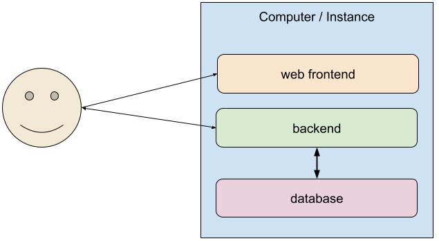
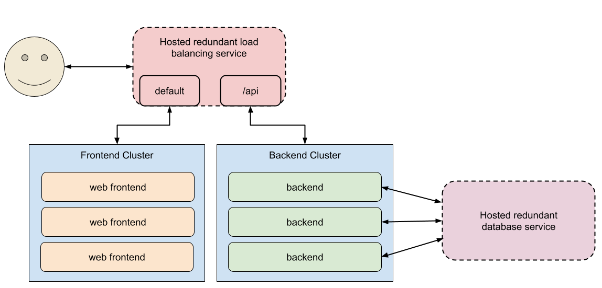

# devops-lab-kit

This repository contains a simple web application (frontend + backend API) designed primarily as a practice ground for learning DevOps concepts and tooling.

These same components could be used to transition from a local development host, to a fully scalable cloud setup:

| Local Setup |Scalable Cloud Setup |
|-|-|
|  |  |

## Table of Contents

1.  [Overview](#overview)
2.  [Proposed Learning Path / Training Scenarios](#proposed-learning-path--training-scenarios)
    *   [Development and Deployment Progression](#development-and-deployment-progression)
        *   [1. Local Development Environment](#1-local-development-environment)
        *   [2. Local Containerization](#2-local-containerization)
        *   [3. Single Remote Server Deployment](#3-single-remote-server-deployment)
        *   [4. Scaling Up / Hybrid Deployment](#4-scaling-up--hybrid-deployment)
        *   [5. Cloud / Orchestrated Deployment](#5-cloud--orchestrated-deployment)
3.  [Core DevOps Practices](#core-devops-practices)
    *   [Branching and Release Management](#branching-and-release-management)
    *   [CI/CD Automation](#cicd-automation)
    *   [Monitoring and Metrics](#monitoring-and-metrics)
4.  [Backend](#backend)
5.  [Frontend](#frontend)
6.  [Infrastructure](#infrastructure)
7.  [Todo](#todo)

## Background

While the information below may seem like "common knowledge" to those with prior experience in the cloud industry, it's important to recognize that this expertise is often assumed and not explicitly taught.

For individuals transitioning directly from university or from careers in embedded systems, concepts like container orchestration, DevOps processes, and cloud-native applications can feel overwhelming.

Using a small, relatable application—such as a simple webshop—as a foundation can bridge the gap between theory and practice. This approach provides a tangible, real-world use case that allows learners to follow the data flow and understand the practical implementation of these concepts.

## Overview

These applications (a React frontend and a Python Flask backend) were largely generated by GitHub Copilot to serve as a demonstration project. The primary purpose of this repository is **not** the web application or the API themselves, but rather to provide a consistent codebase for DevOps training and experimentation.

The focus is on the *process* of developing, building, deploying, and managing these simple services. They act as a practical example that can be taken through various stages, starting from local development on your computer, progressing to containerization (e.g., using Docker), and ultimately deploying to container orchestration platforms in a cloud environment.

## Proposed Learning Path / Training Scenarios

This project can be used to explore various deployment and operational concepts, progressing from simple local setups to more complex cloud deployments.

### Development and Deployment Progression

This section outlines a potential path from running the application locally to deploying it in scalable cloud environments.

#### 1. Local Development Environment

*   Run the backend (Python Flask) and frontend (Vite dev server) directly on your local machine.
*   Interact with the API and the web UI.
*   **Goals:**
    *   Familiarize yourself with the application components and basic manual execution.

#### 2. Local Containerization

*   Build Docker images for both the backend and frontend.
*   Run the application stack locally using `docker run` or `docker-compose`.
*   **Goals:**
    *   Understand containerization basics (Dockerfiles, images, containers).
    *   Learn about container networking.
    *   Manage multi-container applications locally.

#### 3. Single Remote Server Deployment

*   Deploy the application to a single remote server (e.g., a cloud VM or bare metal).
*   **Option A: "Traditional" Deployment:**
    *   Use configuration management (like Ansible) or manual setup.
    *   Install dependencies (Python, Node.js, Nginx, etc.) directly on the host.
    *   Configure a web server (like Nginx) as a reverse proxy.
    *   Manage the application services (e.g., using `systemd`).
*   **Option B: Container Deployment:**
    *   Deploy the pre-built Docker containers to the remote host.
    *   Use `docker run` or `docker-compose` to manage the containers.
    *   Still requires managing Docker itself and potentially a reverse proxy on the host.
*   **Goals:**
    *   Understand the challenges of deploying to a remote environment.
    *   Learn basic server setup and process management (`systemd`).
    *   Configure a reverse proxy (Nginx).
    *   Understand the difference between deploying directly vs. using containers on a single host.
    *   Contrast development setup (like Flask/Vite dev servers) with production-like deployment (using Nginx/Gunicorn/serve).

#### 4. Scaling Up / Hybrid Deployment

*   Introduce concepts needed for handling more load and separating concerns.
*   **External Database:**
    *   Configure the backend to use an external MySQL database instead of the local SQLite file.
    *   This database could be self-hosted (on the same/different server or container) or a managed cloud database service (like AWS RDS, Azure SQL Database, Google Cloud SQL).
*   **Load Balancing:**
    *   Deploy multiple instances of the backend (either traditional or containerized).
    *   Introduce a load balancer (e.g., Nginx, HAProxy, or a cloud provider's load balancer) to distribute traffic across the backend instances.
*   **Goals:**
    *   Learn about decoupling components (database).
    *   Understand horizontal scaling concepts and load balancing strategies.
    *   Learn about managing state (database) separately from stateless application instances.
    *   Explore the trade-offs between self-hosted vs. managed services.

#### 5. Cloud / Orchestrated Deployment

*   Explore deploying the application using cloud-native patterns and orchestration.
*   **Scenario A: Scaled VM Deployment with Cloud Load Balancer:**
    *   Combine concepts from (3A) and (4): Deploy the "Traditional" setup onto multiple cloud VMs managed by an auto-scaling group.
    *   Use a managed cloud load balancer (e.g., AWS ELB, Azure Load Balancer, GCP Load Balancer).
*   **Scenario B: Container Orchestration**
    *   Deploy the application using container orchestration or managed container services.
    *   **Option A: Kubernetes:** Use a Kubernetes cluster (e.g., Minikube, k3s, or a managed service like EKS, AKS, GKE) to orchestrate the deployment. Leverage Kubernetes features such as Deployments (for scaling replicas), Services (for internal load balancing), Ingress (for external access/routing), and ConfigMaps/Secrets (for configuration like database connection strings).
    *   **Option B: Managed Container Services:** Use a managed container service like Amazon ECS, Azure Container Instances, or Google Cloud Run to deploy and manage the application without the need to manage the underlying orchestration infrastructure.
    *   **Option C: Platform-as-a-Service (PaaS):** Deploy the application to a PaaS solution like Heroku or Azure App Service, which abstracts away container orchestration and infrastructure management.
*   **Goals:**
    *   Understand the trade-offs between self-managed orchestration (e.g., Kubernetes) and fully managed services (e.g., ECS, Cloud Run).
    *   Learn how to configure and deploy containerized applications in different environments.
    *   Explore the benefits of declarative configuration, automated scaling, and service discovery.
    *   Gain experience with managed services that simplify deployment and scaling.
    *   Understand cloud infrastructure concepts (VMs, auto-scaling, managed load balancers).
    *   Learn the fundamentals of container orchestration (Kubernetes).
    *   Understand declarative configuration, automated scaling, self-healing, and service discovery in Kubernetes.
    *   Contrast infrastructure-as-code/orchestration with manual server management.

## Core DevOps Practices

Beyond the deployment scenarios, this project serves as a foundation for exploring essential DevOps practices. These topics are fundamental to managing the software lifecycle effectively and can be adapted to specific toolchains, technology stacks, and organizational processes. While related, they can often be implemented and learned independently.

### Branching and Release Management

*   Define and implement a branching strategy for managing code changes and releases.
*   **Common Strategies:**
    *   **Gitflow:** A structured model with dedicated branches for features, releases, hotfixes, develop, and main/master. Often considered complex for simpler projects or continuous delivery.
    *   **GitHub Flow / GitLab Flow:** Simpler models often based on feature branches merged directly or indirectly into a main branch, which is always deployable. Trunk-Based Development is a variation.
    *   **Trunk-Based Development:** All developers commit to a single main branch, relying heavily on feature flags and strong automated testing.
*   **Release Process:**
    *   How are releases versioned (e.g., Semantic Versioning)?
    *   How are release candidates created and tested?
    *   How is a release promoted to production? (Tied into CD pipeline).
    *   How are hotfixes handled?
*   **Goals:**
    *   Understand different branching models and their trade-offs.
    *   Establish a consistent workflow for code integration and releases.
    *   Ensure code stability and traceability through versioning.
    *   Facilitate collaboration among developers.
    *   Enable safe and repeatable deployments.

### CI/CD Automation

*   Implement Continuous Integration (CI) and Continuous Deployment/Delivery (CD) pipelines to automate the build, test, and deployment processes.
*   **Tools:** Use platforms like GitHub Actions, GitLab CI/CD, Jenkins, or others.
*   **CI Pipeline:**
    *   Trigger on code pushes or pull requests.
    *   Lint code (e.g., using ESLint for frontend, Flake8/Black for backend).
    *   Run automated tests (unit tests, integration tests) - **Currently not present in this demo**.
    *   Build Docker images for backend and frontend.
    *   Push images to a container registry (e.g., Docker Hub, GitHub Container Registry, AWS ECR, etc.).
*   **CD Pipeline:**
    *   Trigger after successful CI or manually.
    *   Deploy the new container images to a target environment (e.g., staging, production).
    *   Deployment strategies could include:
        *   Updating containers on VMs (using Ansible/SSH).
        *   Updating Kubernetes Deployments (using `kubectl apply` or GitOps tools like Argo CD/Flux).
*   **Goals:**
    *   Understand the principles of CI/CD.
    *   Learn how to automate build, test, and deployment workflows.
    *   Gain experience with CI/CD tools and platforms.
    *   Implement automated quality gates (linting, testing).
    *   Learn about different deployment strategies and environment management.

### Monitoring and Metrics

*   Implement monitoring solutions to observe the application's health, performance, and resource usage.
*   **Key Areas:**
    *   **Application Performance Monitoring (APM):** Track request latency, error rates, and transaction traces within the backend API. (e.g., using libraries integrated with Flask).
    *   **Infrastructure Metrics:** Monitor CPU, memory, disk I/O, and network usage of the servers or containers running the application.
    *   **Log Aggregation:** Collect logs from the backend, frontend (if applicable), and infrastructure components into a centralized system for analysis and troubleshooting.
    *   **Uptime/Availability Monitoring:** Set up external checks to ensure the application endpoints are reachable and responding correctly.
*   **Potential Tools:**
    *   **Metrics/Visualization:** Prometheus + Grafana, Datadog, New Relic, Dynatrace, CloudWatch/Azure Monitor/Google Cloud Monitoring.
    *   **Logging:** Elasticsearch + Logstash/Fluentd + Kibana (ELK/EFK Stack), Loki, Splunk, Datadog Logs, CloudWatch Logs/Azure Log Analytics/Google Cloud Logging.
    *   **Alerting:** Alertmanager (with Prometheus), Grafana Alerting, PagerDuty, Opsgenie, Cloud provider alerting services.
*   **Goals:**
    *   Understand the importance of monitoring for operational health and performance.
    *   Learn about different types of monitoring (metrics, logs, traces).
    *   Gain experience setting up and configuring monitoring tools.
    *   Learn how to create dashboards to visualize key metrics.
    *   Understand how to set up basic alerting based on metrics or logs.

## Backend

The backend is a Python Flask application. It provides a REST API for the web application, that can also be used on its own.

It uses a local SQLite database by default, but can be configured to use a MySQL database on another host.

You can find more details in the [Backend README](./backend/README.md).

## Frontend

The frontend is a TypeScript application built using VITE. It serves the user interface for the web application.

The API base URL is customisable to demonstrate how a user could run the web service at one computer, but use a backend somewhere else. (And to demonstrate CORS handling and "Mixed Content" TLS errors).

You can find more details in the [Frontend README](./frontend/README.md).

## Infrastructure

The `infrastructure/` directory contains configurations for setting up cloud resources, primarily using Terraform.

*   **`infrastructure/azure/`**: Contains the main Terraform configuration for Azure resources.
    *   Defines the core provider setup, resource group.
    *   Calls child modules for specific resources like virtual machines.
    *   **Run `terraform init/plan/apply` from this directory** to manage the Azure setup.
*   **`infrastructure/azure/virtual-machine/`**: A child module defining the resources for a basic Ubuntu VM with network components (VNet, Subnet, NIC, Public IP, NSG). It receives configuration like resource group name and location from the parent `azure` module.

## Todo

*   Made the backend API return the hostname
    *   Will give a much better understanding of load balancing when scaling up horizontaly.
*   Make log level configurable - implement proper logging instead of prints.
*   Make multi stage build for frontend container
*   Add Azure load balancer
