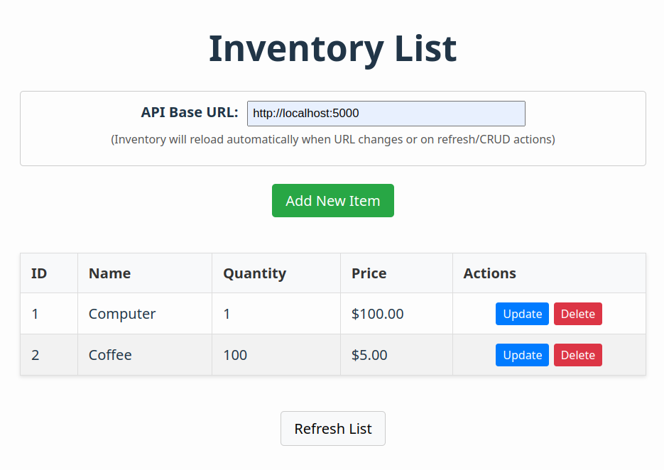

# Inventory Web App Frontend

This is the web app frontend for the Inventory Management System.

It's a `React` application written in `TypeScript`, created with `Vite` and `NodeJS`.

**WARNING:** I'm absolutely not a frontend developer. 90% of the code here is AI generated and I really don't know what I'm doing!

## Table of Contents

- [Overview](#overview)
- [Deployment](#deployment)
- [Development and Build](#development-and-build)
    - [Using Docker (Recommended)](#using-docker-recommended)
        - [Running the Development Server](#running-the-development-server)
        - [Building the Production Image](#building-the-production-image)
        - [Running the Production Container Locally](#running-the-production-container-locally)
        - [Extracting Build Artifacts (Optional)](#extracting-build-artifacts-optional)
    - [Local Node.js Environment (Alternative)](#local-nodejs-environment-alternative)

## Overview

The frontend provides a simple user interface for the inventory application, interacting with the [backend API](../backend/README.md).

<a href="web_frontend.png" target="_blank">
  
</a>

The API base URL is configurable within the UI. This allows demonstrating scenarios like running the frontend and backend on different hosts, and dealing with potential CORS or "Mixed Content" issues.

**Remember:** The primary purpose of this application is to serve as a practical example for learning DevOps principles and deployment strategies, NOT to be a feature-complete or robust application. It's generally very basic, lacks automated testing, and has minimal security considerations.

## Deployment

As all output is just static HTML and JavaScript, this application could be used to explore several different deployment techniques:

* Manual local deployment: Set up a web server on your local computer to serve the content (also see development and build).
* Container app deployment behind a traditional load balancer.
* Cloud deployment (e.g., Azure App Services).

## Development and Build

### Using Docker (Recommended)

Using Docker provides a consistent environment for development and building.

*   [`Dockerfile`](frontend/Dockerfile ): A multi-stage build file that first builds the application and then creates a final production image using Nginx to serve the static files.
*   [`Dockerfile.dev`](frontend/Dockerfile.dev ): Runs a local Vite development server with hot-reloading for live development.

#### Running the Development Server

1.  **Build the dev container image:**
    ```bash
    docker build -t frontend-dev -f Dockerfile.dev .
    ```
2.  **Run the dev container:**
    ```bash
    # This mounts the local 'webapp' source code into the container.
    # Changes made locally will trigger the Vite server to reload.
    # Node modules are kept in a volume within the container for performance.
    docker run -it --rm \
      -p 5173:5173 \
      -v $(pwd)/webapp:/app \
      -v /app/node_modules \
      --name frontend-dev-container \
      frontend-dev
    ```
    Access the development server at `http://localhost:5173`.

#### Building the Production Image

1.  **Build the production image using the multi-stage Dockerfile:**
    ```bash
    # This command builds the final Nginx-based image
    docker build -t inventory-frontend -f Dockerfile .
    ```

#### Running the Production Container Locally

1.  **Run the production container:**
    ```bash
    # Map port 8080 on your host to port 80 in the container
    docker run -d --rm \
      -p 8080:80 \
      --name frontend-prod-container \
      inventory-frontend
    ```
    Access the production build at `http://localhost:8080`. The `-d` flag runs it in detached mode. Use `docker logs frontend-prod-container` to see Nginx logs or `docker stop frontend-prod-container` to stop it.

#### Extracting Build Artifacts (Optional)

If you need the compiled static files (`dist` directory) outside the production image for inspection or manual deployment:

```bash
# Use docker build with the --output flag to copy the 'dist' folder
# This requires BuildKit enabled (default in recent Docker versions)
docker build --target builder --output type=local,dest=./dist -f Dockerfile .
```
This command tells Docker to build only up to the `builder` stage defined in the [`Dockerfile`](frontend/Dockerfile ) and copy its output (`/app/dist`) to a local directory named `dist`.

### Local Node.js Environment (Alternative)

If you prefer not to use Docker, you can set up a local Node.js environment. See [Local Node.js Setup](./docs/local-nodejs.md) for instructions.

